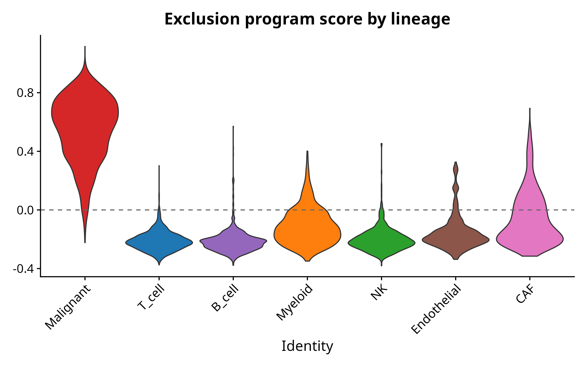

## Background

Melanoma is one of the most immunogenic solid tumors and the cancer type where immune checkpoint blockade (ICB) was first established as a frontline therapy. Despite the success of anti-PD1 and anti-CTLA4 in a subset of patients, resistance to ICB remains a major clinical problem. Jerby-Arnon et al. (Cell, 2018) used single-cell RNA-seq of metastatic melanoma to define a transcriptional program in malignant cells - a 'T cell exclusion / ICB-resistance program' - whose expression is associated with reduced T cell infiltration and predicts poor response to checkpoint blockade. This signature has since become a reference framework for biomarker stratification in melanoma immunotherapy.

This project reproduces the key elements of the Jerby-Arnon analysis: lineage characterization of the melanoma tumor microenvironment, validation against author-curated ground truth, scoring of the malignant-cell resistance program, and detailed sub-clustering of the T cell compartment to expose exhaustion, cytotoxicity, and Treg sub-states relevant to immune-oncology workflows.

## Dataset

- **Source:** Jerby-Arnon L, Shah P, Cuoco MS, et al. *A Cancer Cell Program Promotes T Cell Exclusion and Resistance to Checkpoint Blockade.* Cell 175, 984-997 (2018). DOI: 10.1016/j.cell.2018.09.006
- **Accession:** GEO **GSE115978**
- **Cells analyzed:** 7,132 cells (post-QC) from 33 metastatic melanoma tumors
- **Platform:** Smart-seq2 (deep per-cell coverage)
- **Compartments:** Malignant + 6 non-malignant lineages (T, B, Myeloid, NK, Endothelial, CAF)

## Methods

Analysis was performed in R 4.3 using Seurat 5.3. Workflow:

1. **Data ingest.** Counts matrix and cell-level annotations downloaded from GEO and merged on cell barcode.
2. **Quality control.** Per-cell metrics with thresholds: at least 500 genes, fewer than 10,000 genes per cell, mitochondrial fraction below 25 percent.
3. **Normalization.** Log-normalization with scale factor 10,000; 3,000 highly variable genes.
4. **Embedding and clustering.** PCA (50 components), UMAP (30 dims), and Louvain clustering at resolution 0.5.
5. **Lineage annotation.** Seven lineage signatures (Malignant, T cell, B cell, Myeloid, NK, Endothelial, CAF) scored per cell with `AddModuleScore`; each cell was assigned the lineage with the highest score, then validated against the author-curated `non.malignant.cell.type` labels.
6. **ICB-resistance program scoring.** A 48-gene signature derived from Jerby-Arnon Table S5 (resistance program up-regulated genes) was scored per cell using `AddModuleScore`. Lineage-stratified analysis tested whether the program is malignant-cell-specific as predicted by the original publication.
7. **T cell sub-state analysis.** T cells were subset, re-clustered at higher resolution (0.4), and scored against seven canonical sub-state panels (CD8, CD4, Treg, Cytotoxic, Exhaustion, Naive/Memory, Proliferation) to expose immune-oncology relevant sub-populations.

## Results

### Reproducible lineage annotation with ground-truth validation

Marker-based scoring recovered seven well-separated lineages in the integrated melanoma TME landscape.

{width=85%}

Cross-validation against the author-curated lineage labels distributed with the dataset confirmed concordant assignment across all major compartments, providing an external check that the annotation pipeline correctly identifies cell types without manual curation.

### ICB-resistance program is correctly localized to malignant cells

The 48-gene ICB-resistance signature from Jerby-Arnon Table S5 was scored in every cell. All 48 signature genes were present in the dataset and contributed to the score.

{width=80%}

The lineage-stratified score distribution further confirms specificity: the program is detectable above background only in malignant cells, with all immune and stromal lineages scoring near zero. This is the expected pattern from Jerby-Arnon and demonstrates that the scoring methodology correctly transfers the published gene set to a new analytical pipeline.

{width=85%}

### T cell sub-state characterization

T cells (n = 2,306, 32 percent of the dataset) were subset and re-clustered, yielding six T cell sub-clusters. Each cluster was characterized by seven canonical sub-state signatures.

![**Figure 4.** T cell sub-state scores projected on the T cell UMAP. CD8 and CD4 signatures occupy reciprocal regions of the embedding; Treg cells form a localized population in the upper area; Cytotoxic and Exhaustion scores light up in distinct CD8-positive regions; Naive/Memory cells are concentrated in a single cluster; Proliferating T cells appear as a small distinct island. This map provides direct access to immune-checkpoint-relevant sub-populations (PD1-high exhausted CD8, FOXP3-positive Treg, cytotoxic effector CD8) for downstream client-specific analysis.](../figures/04_tcell_substate_scores.png){width=95%}

A complementary dot plot of canonical T cell markers across the six Louvain sub-clusters provides a per-cluster summary of marker expression and an interpretable basis for assigning functional labels to each sub-cluster.

## Interpretation

This project demonstrates a complete immuno-oncology scRNA-seq workflow in Seurat: TME annotation with ground-truth validation, cancer-cell program scoring from a published signature, and T cell drill-down with exhaustion / cytotoxicity / Treg / proliferation panels. The methodological elements most relevant for client work are: (1) automatic lineage annotation that does not require manual cluster-to-cell-type curation when good marker panels are available, (2) gene-signature scoring with `AddModuleScore` that can apply any published or proprietary panel to a new dataset and verify its cell-type specificity, and (3) sub-cluster characterization at the level needed for biomarker discovery in checkpoint-blockade studies.

The exclusion-program reproduction shown here is a *score-level* reproduction - the program is correctly localized to malignant cells with the expected within-tumor heterogeneity. A full cohort-level test of the original clinical claim (program expression predicts ICB resistance) was outside the scope of this portfolio project; per-tumor exploratory analyses are available in the repository for reference.

## Reproducibility

- **Code:** `github.com/zivanovicmkg/scrnaseq-portfolio/tree/main/04_melanoma_immune`
- **Environment:** conda env from `environment.yml` (R 4.3, Seurat 5.3, tidyverse, patchwork)
- **Random seed:** 42 throughout
- **Run time:** approximately 15-20 minutes after data download on a 16-core machine

## References

1. Jerby-Arnon L, Shah P, Cuoco MS, et al. *A Cancer Cell Program Promotes T Cell Exclusion and Resistance to Checkpoint Blockade.* Cell 175, 984-997 (2018).
2. Hao Y, Hao S, Andersen-Nissen E, et al. *Integrated analysis of multimodal single-cell data.* Cell 184, 3573-3587 (2021).
3. Tirosh I, Izar B, Prakadan SM, et al. *Dissecting the multicellular ecosystem of metastatic melanoma by single-cell RNA-seq.* Science 352, 189-196 (2016).
