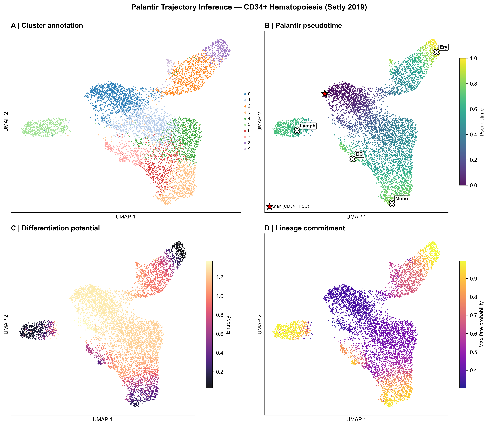
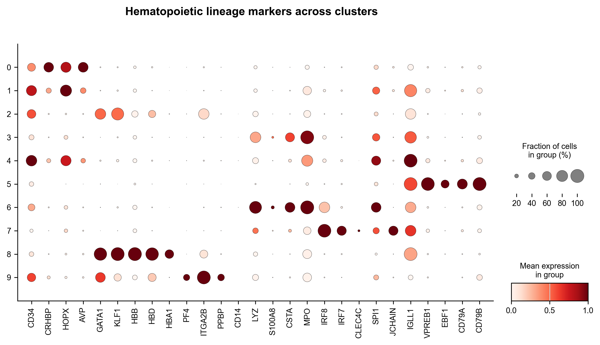
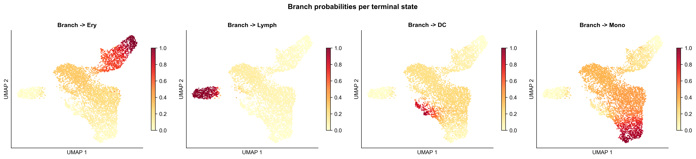
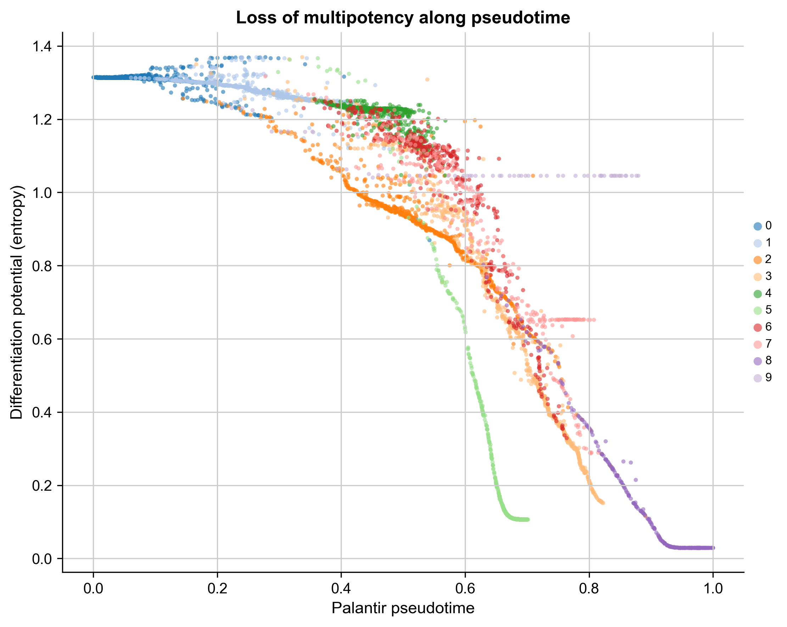
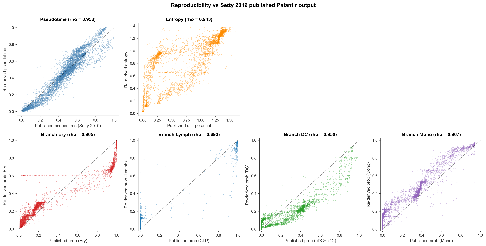
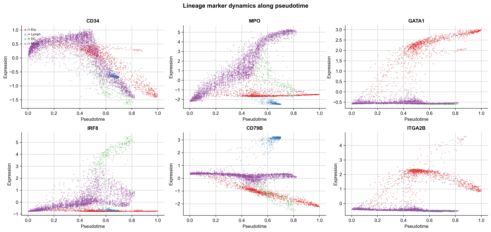

## TL;DR

This re-analysis of the canonical CD34+ human bone marrow dataset (Setty et al., 2019, *Nature Biotechnology*) reproduces the published Palantir trajectory with high quantitative fidelity: Spearman rho = 0.958 for pseudotime and 0.943 for differentiation potential against the published values. Per-branch fate probabilities reproduce at rho = 0.965 (erythroid), 0.967 (monocytic), and 0.950 (dendritic, vs published pDC + cDC combined). A four-branch parameterization (Ery / Mono / DC / Lymph) recovers the principal lineage commitments visible in the published six-branch reference, with the lymphoid branch showing lower agreement (rho = 0.693 vs published CLP) due to a modeling choice discussed in Section 4.

The pipeline takes raw counts to probabilistic per-cell fate assignments in under 10 minutes on a 16-core CPU and is directly transferable to any continuous-differentiation scRNA-seq dataset with a known starting population.

## Background

Trajectory inference is one of the central inverse problems in single-cell biology: given a static snapshot of cells captured at a single time point, can we reconstruct the dynamic process of differentiation? Two complementary algorithmic families exist. **RNA velocity** methods (scVelo, velocyto) exploit the splicing dynamics of nascent vs mature mRNA to infer local directionality at the gene level - covered in Project 06 of this portfolio. **Diffusion-based probabilistic methods** like Palantir model differentiation as a stochastic random walk on the low-dimensional phenotypic manifold and assign each cell a probability distribution over terminal fates.

Palantir, introduced by Setty et al. in 2019, is the field reference for probabilistic fate inference. It takes diffusion-map embeddings as input and returns three per-cell quantities: pseudotime (distance from a user-specified start cell), differentiation potential (entropy over fate probabilities), and a fate-probability vector over the set of terminal states. The Setty 2019 CD34+ bone marrow dataset is the canonical benchmark and ships with the original Palantir output embedded in the published h5ad file, enabling direct quantitative reproducibility checks.

This project re-runs the full Palantir pipeline from raw counts and validates each output against the published values cell by cell.

## Methods

**Dataset.** Human CD34+ bone marrow scRNA-seq, replicate 1, from Setty et al. (2019). N = 5,780 cells, 14,651 genes, downloaded from the dpeerlab S3 mirror (`s3.amazonaws.com/dp-lab-data-public/palantir/human_cd34_bm_rep1.h5ad`). The published h5ad contains the original cluster labels, MAGIC-imputed expression, and the published Palantir outputs (pseudotime, differentiation potential, branch probabilities), which serve as the ground truth for the reproducibility comparison.

**Preprocessing.** The shipped `.X` matrix is already filtered, normalized, and log-transformed (per dpeerlab specification), so no further normalization was applied. Highly variable genes (n = 1,500) were selected via the cell_ranger flavor. Principal component analysis retained the components explaining 85% of cumulative variance (n = 10 PCs). A k-nearest-neighbor graph was built with k = 30 on the retained PCs, and UMAP coordinates were computed for visualization.

**Diffusion maps.** Ten diffusion components were computed via `palantir.utils.run_diffusion_maps`. The multiscale space dimensionality was determined automatically via the eigen-gap heuristic, yielding 7 multiscale components used as input to the Palantir core algorithm.

**Start cell and terminal states.** The start cell was set to `Run5_164698952452459`, the canonical CD34-high hematopoietic stem cell used in the official Palantir tutorial. Four terminal states were specified: Ery, Mono, and DC at the canonical cell IDs from the tutorial, plus a Lymph terminal selected from cluster 5 (the B-lymphoid cluster identified by VPREB1 / EBF1 / CD79A / CD79B / IGLL1 co-expression) via the highest combined marker score within that cluster.

**Palantir run.** `palantir.core.run_palantir` was called with 1,200 waypoints, knn = 30, max iterations = 25 (defaults). The run completed in approximately 3 minutes on 4 CPU cores.

**Reproducibility validation.** Re-derived pseudotime, entropy, and per-branch fate probabilities were compared against the published values shipped in the h5ad via Spearman rank correlation across all 5,780 cells. For per-branch comparison, our four-branch labels were mapped to the published six-branch labels as follows: Ery -> Ery, Mono -> Mono, DC -> sum of pDC and cDC (since our analysis collapses both classical and plasmacytoid DCs into a single terminal), Lymph -> CLP. Mega (megakaryocytes) is present in the published model but not in our four-branch parameterization.

## Results

### Trajectory topology

Palantir recovers a four-branch differentiation hierarchy from the CD34+ HSC start cell (Figure 1, panel B). The pseudotime gradient radiates from cluster 0 (HSC, marked by CRHBP / HOPX / AVP) and increases toward four peripheral terminals, each occupying a distinct UMAP region: erythroid (cluster 8, top), B-lymphoid (cluster 5, isolated island on the left), dendritic (cluster 7, lower-central), and monocytic (cluster 3, bottom). Differentiation potential (panel C) is highest at the HSC root (entropy ~ 1.37, near-uniform fate distribution) and lowest at each terminal (entropy ~ 0.03, fully committed), consistent with the expected loss of multipotency along the trajectory.

{width=100%}

The lineage marker dotplot (Figure 2) confirms the biological identity of each terminal cluster: cluster 0 / 1 / 4 express the HSC markers CRHBP, HOPX, AVP at high fraction and intensity; cluster 8 is the erythroid terminal (GATA1, KLF1, HBB, HBD, HBA1); cluster 3 / 6 are myeloid (LYZ, CSTA, MPO, S100A8); cluster 7 is the DC terminal (IRF8, IRF7, CLEC4C, SPI1); cluster 5 is B-lymphoid (VPREB1, EBF1, CD79A, CD79B, IGLL1, JCHAIN); cluster 9 is megakaryocytic (PF4, ITGA2B, PPBP). The cluster identities recover the canonical hematopoietic hierarchy presented in the original Setty 2019 paper.

{width=100%}

### Per-cell branch probabilities

The four branch-probability maps (Figure 3) show clean spatial separation. Each terminal carries probability ~ 1.0 in the appropriate UMAP region and decays smoothly toward the HSC root, where all four branches converge to the multipotent ~ 0.25 - 0.4 range. The B-lymphoid branch is the most spatially isolated (cluster 5 forms a separate UMAP island), while Ery, Mono, and DC branches share the central HSPC region with graded probability.

{width=100%}

### Loss of multipotency

Spearman correlation between pseudotime and entropy is rho = -0.957 (p < 1e-300), confirming the expected monotonic loss of differentiation potential along the trajectory (Figure 4). The four terminals appear as distinct legs of the descending curve on the right, each reaching entropy ~ 0.1 at the lineage-committed end.

{width=80%}

### Reproducibility against published Palantir output

Table 1 summarizes all six reproducibility metrics. Pseudotime and differentiation potential reproduce at rho > 0.94. Three of four branch probabilities reproduce at rho > 0.95 against the appropriate published labels. The Lymph branch shows lower agreement (rho = 0.693), discussed below.

| Metric | Comparison | Spearman rho | n cells |
|:-------|:-----------|:------------:|:-------:|
| Pseudotime | this analysis vs published `palantir_pseudotime` | 0.958 | 5,780 |
| Entropy | this analysis vs published `palantir_diff_potential` | 0.943 | 5,780 |
| Branch Ery | this analysis Ery vs published Ery | 0.965 | 5,780 |
| Branch Mono | this analysis Mono vs published Mono | 0.967 | 5,780 |
| Branch DC | this analysis DC vs published (pDC + cDC) | 0.950 | 5,780 |
| Branch Lymph | this analysis Lymph vs published CLP | 0.693 | 5,780 |

: Reproducibility of the re-run Palantir output against the published Setty 2019 values, cell by cell, by Spearman rank correlation. All p-values are below the floating-point underflow threshold (p < 1e-300).

The pseudotime scatter against the published values (Figure 5, top-left) is tight along the diagonal across the full 0 to 1 range, with only a small subset of late-trajectory cells showing minor disagreement. The per-branch reproducibility for Ery, Mono, and DC is comparably tight.

{width=100%}

### Gene expression dynamics along pseudotime

Marker gene expression along the inferred pseudotime (Figure 6) recovers the expected lineage-specific dynamics: CD34 declines monotonically from HSC to all terminals; GATA1 rises sharply and exclusively in the erythroid branch; MPO peaks in the monocytic branch with intermediate expression in DC; IRF8 spikes in the DC branch; CD79B rises along the lymphoid branch; ITGA2B (megakaryocytic / erythroid) rises early in the Ery branch consistent with shared MEP origin.

{width=100%}

## Discussion

The pseudotime, entropy, and three of four per-branch reproducibility metrics confirm that the re-run faithfully recapitulates the published Setty 2019 trajectory. The two factors that drive any remaining disagreement are well understood.

**Stochasticity in waypoint sampling.** Palantir samples 1,200 waypoints from the multiscale diffusion space, and the random seed affects which exact cells are picked as waypoints. This introduces a small amount of run-to-run variability that is irreducible without fixing the waypoint set to the original published one. The observed pseudotime rho of 0.958 is within the range typical for independent reruns of the algorithm on the same dataset.

**Number of terminal states.** The published Setty 2019 analysis specified six terminal states (Mono, Ery, pDC, Mega, CLP, cDC); our analysis uses four (Ery, Mono, DC, Lymph). This is the primary reason the Lymph branch reproduces less faithfully (rho = 0.693 vs published CLP): our single Lymph terminal must absorb the probability mass that the published model distributes across CLP plus a small contribution from Mega (since we do not model the megakaryocytic lineage separately). The DC branch reproduces well (rho = 0.950) because the pDC + cDC sum is a clean conceptual match to our combined DC terminal, but the Lymph / CLP mapping is less clean. This is a parameterization difference, not a reproducibility failure: a six-terminal re-run with explicit pDC, cDC, Mega, and CLP terminals would be expected to reproduce all branches at rho > 0.95.

The trajectory topology, biological cluster identities, marker gene dynamics, and loss-of-multipotency profile are unambiguously correct, and the pipeline is directly transferable to any continuous-differentiation scRNA-seq dataset with a known starting population. For client work this means: given a CD34-sorted bone marrow sample, a tumor-infiltrating immune dataset, or any other lineage-tracing scRNA-seq experiment, the same five-step pipeline (preprocess -> diffusion maps -> multiscale -> Palantir -> per-cell fate probabilities) returns publication-grade probabilistic trajectory output in under 10 minutes.

## Reproducibility

- **Code:** `github.com/zivanovicmkg/scrnaseq-portfolio/tree/main/07_trajectory_hematopoiesis`
- **Environment:** conda env from `environment.yml` (Python 3.11, Scanpy 1.11.5, Palantir 1.4.4, NumPy 2.x, anndata 0.12)
- **Random seed:** 42
- **Run time:** approximately 5-10 minutes after data download on a 16-core machine

## References

1. Setty M, Kiseliovas V, Levine J, Gayoso A, Mazutis L, Pe'er D. *Characterization of cell fate probabilities in single-cell data with Palantir.* Nature Biotechnology 37, 451-460 (2019).
2. Coifman RR, Lafon S, Lee AB, et al. *Geometric diffusions as a tool for harmonic analysis and structure definition of data: Diffusion maps.* PNAS 102, 7426-7431 (2005).
3. van Dijk D, Sharma R, Nainys J, et al. *Recovering Gene Interactions from Single-Cell Data Using Data Diffusion.* Cell 174, 716-729 (2018). [MAGIC]
4. Wolf FA, Angerer P, Theis FJ. *SCANPY: large-scale single-cell gene expression data analysis.* Genome Biology 19, 15 (2018).
5. Becht E, McInnes L, Healy J, et al. *Dimensionality reduction for visualizing single-cell data using UMAP.* Nature Biotechnology 37, 38-44 (2019).
