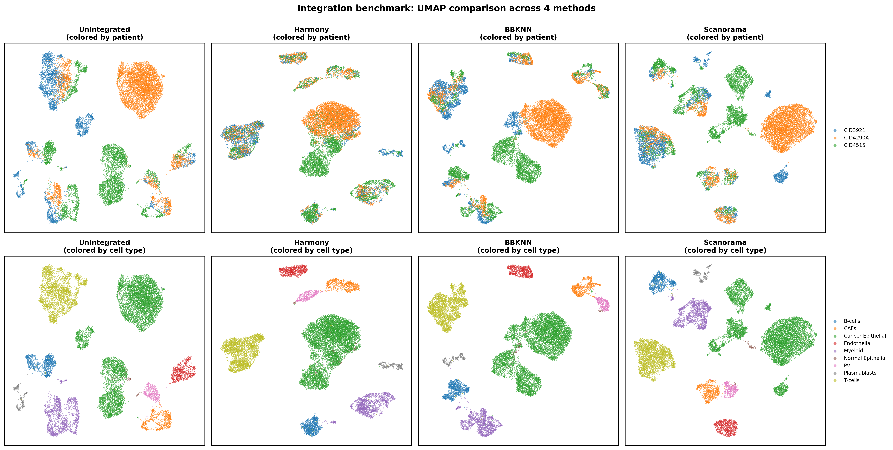
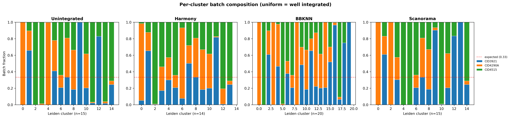
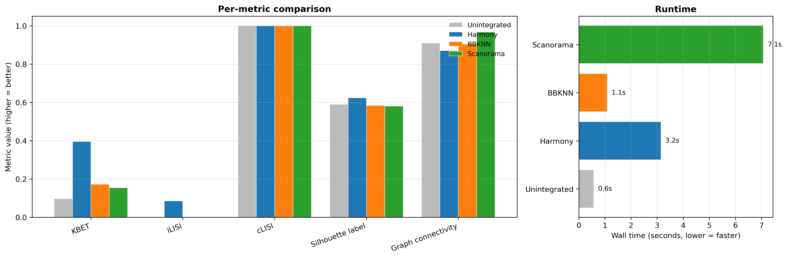

## TL;DR

Head-to-head benchmark of the three most widely used Python-native scRNA-seq batch integration methods (Harmony, BBKNN, Scanorama) on a real multi-patient breast cancer tumor microenvironment dataset (Wu et al. 2021, GSE176078, 3 patients, 12,962 cells, 9 cell types). Evaluation uses the metrics from Luecken et al. 2022 (scIB benchmark) via the `scib-metrics` Python package: kBET, iLISI, cLISI, silhouette by batch and by label, graph connectivity, isolated-label F1, NMI/ARI of KMeans clustering.

**Headline finding:** Harmony wins across all three aggregate categories (Total 0.656, Batch correction 0.579, Bio conservation 0.707). BBKNN and Scanorama tie for second place on the total score, but BBKNN is 6.4x faster than Scanorama (1.1s vs 7.1s) and preserves more biological structure. Unintegrated baseline retains the highest biological conservation but fails batch correction, as expected.

The result is a concrete recommendation for client work: **Harmony is the default choice for multi-patient TME datasets in this size range**; BBKNN is the speed-optimized fallback when integrating very large atlases.

## Background

Multi-sample scRNA-seq experiments - multiple patients, multiple tissues, multiple time points, multiple sequencing batches - universally introduce technical variation that confounds downstream biology. Cells from the same lineage but different samples cluster separately because of patient identity rather than cell-type identity. Batch integration methods try to remove this technical variance while preserving real biological signal.

There is no free lunch. Stronger batch correction tends to erase finer biological substructure. Weaker correction preserves biology but leaves the data unusable for cross-sample comparisons. Choosing an integration method is therefore a quantified trade-off, not a default. The 2022 Nature Methods scIB paper (Luecken et al.) formalized this trade-off by defining two metric families:

- **Batch correction metrics**: kBET (k-nearest-neighbor batch effect test), iLISI (local inverse Simpson's index for batch diversity), silhouette by batch, graph connectivity, PCR comparison
- **Bio conservation metrics**: cLISI (local inverse Simpson's index for cell-type purity), silhouette by label, isolated label F1 and silhouette, NMI/ARI of KMeans clustering against ground-truth labels

A good integration scores high on both. The `scib-metrics` package (YosefLab) re-implements all of these in JAX/Python with hardware acceleration, enabling fast head-to-head benchmarks without dropping into R.

## Methods

**Dataset.** Wu et al. 2021 breast cancer atlas, GEO GSE176078. We use three representative patients (CID3921, CID4290A, CID4515) spanning three molecular subtypes (ER+, HER2+, TNBC) with 12,962 cells and 9 author-annotated cell types: Cancer Epithelial, T-cells, Myeloid, CAFs, Endothelial, PVL, Normal Epithelial, Plasmablasts, B-cells. The dataset is reused from Project 02 of this portfolio.

**Preprocessing.** Log-normalized expression from the published h5ad, 2,000 highly variable genes selected with the Seurat flavor and batch-aware HVG computation (`batch_key='orig.ident'`). PCA on HVGs, top 30 components used as input to all integration methods.

**Methods compared:**

- **Unintegrated baseline**: PCA on HVGs, no batch correction
- **Harmony** (`harmonypy 0.2.0`): iterative soft-clustering correction of PCA embeddings, 20 iterations max
- **BBKNN** (`bbknn 1.6.0`): batch-balanced k-nearest neighbors graph, 10 neighbors per batch on top 30 PCs. For metric scoring, we use the diffusion map computed from the BBKNN-modified kNN graph (the standard approach when a continuous embedding is required for embedding-based metrics)
- **Scanorama** (`scanorama 1.7.4`): mutual-nearest-neighbor alignment across per-batch PCA embeddings, 50 dimensions

**Metric computation.** All four embeddings (`Unintegrated`, `Harmony`, `BBKNN`, `Scanorama`) are passed to `scib_metrics.benchmark.Benchmarker`. The benchmarker computes a fresh kNN graph for each embedding and runs all metrics in parallel. Random seed = 42, n_jobs = 4. Runtime is measured wall-clock per method.

## Results

### UMAP visualization

The first qualitative check is whether each method removes the visible batch separation that dominates the unintegrated UMAP. Figure 1 shows the four embeddings side by side, with the top row colored by patient and the bottom row by author-annotated cell type.

{width=100%}

In the **Unintegrated** panel, the largest blob in the center is the CID4290A cancer epithelial population, which forms a separate island from CID4515 cancer epithelial cells - the patient effect dominates over the shared epithelial identity. **Harmony** collapses these into a single epithelial mass with all three patients evenly distributed, while still separating cancer epithelial from the other 8 lineages. **BBKNN** also mixes patients well but produces a slightly more fragmented structure. **Scanorama** shows partial integration - some clusters mix patients (the central Cancer Epithelial blob) while others remain patient-dominated (T-cells on the left).

### Per-cluster batch composition

Figure 2 quantifies the UMAP impression: for each method, we cluster the integrated embedding with Leiden and compute the fraction of each patient per cluster. Well-integrated data has every cluster crossing the red dashed line at 1/3 (the expected uniform fraction for three balanced batches).

{width=100%}

Harmony has the highest fraction of well-mixed clusters (most bars cross or approach 1/3). BBKNN comes second with about 60% of clusters reasonably mixed. Scanorama is closer to Unintegrated than to Harmony - many clusters remain single-patient dominant, reflecting that Scanorama's MNN-based alignment is gentler.

### Quantitative scIB metrics

Table 1 summarizes the three aggregate scores from `scib-metrics`. Each score is the average of multiple component metrics, min-max scaled across methods so the worst method on each metric gets 0 and the best gets 1.

| Method | Batch correction | Bio conservation | **Total** |
|:-------|:----------------:|:----------------:|:---------:|
| **Harmony**    | **0.579** | **0.707** | **0.656** |
| BBKNN          | 0.487     | 0.681     | 0.603     |
| Scanorama      | 0.478     | 0.679     | 0.599     |
| Unintegrated   | 0.382     | 0.706     | 0.576     |

: Aggregate scIB benchmark scores. Higher is better in all columns. The Total score is a 60/40 weighted combination of batch correction and bio conservation per the scIB paper convention. Harmony ranks first across all three categories.

Three observations from this table:

1. **Harmony's advantage is in batch correction.** It scores +0.09 over BBKNN and +0.10 over Scanorama on batch correction, while bio conservation is essentially tied with Unintegrated (Harmony 0.707 vs Unintegrated 0.706). This means Harmony removes batch effects *without* sacrificing biological structure - the ideal trade-off.

2. **BBKNN and Scanorama are nearly tied on Total.** Their batch correction scores differ by only 0.01, and their bio conservation by 0.002. On this dataset they are functionally interchangeable on the metric axis, so the choice between them comes down to runtime.

3. **Unintegrated has good bio conservation but terrible batch correction**, as expected. It is the natural floor for any integration method to beat. Scanorama beats this floor by +0.10 on batch correction; Harmony beats it by +0.20.

Figure 3 shows the individual metric breakdown and runtime profile.

{width=100%}

The metric-level view confirms Harmony's lead on KBET (0.40 vs ~0.10 for others) and iLISI (only Harmony scores meaningfully above zero). cLISI is saturated at 1.0 across all methods - cell type purity is preserved by every method including Unintegrated, which means the dataset has well-separated cell types that survive any reasonable embedding. Silhouette label and graph connectivity are tightly clustered around 0.59-0.91 across methods.

### Runtime profile

| Method       | Wall time (s) | Speed vs Harmony |
|:-------------|:-------------:|:----------------:|
| Unintegrated | 0.5           | baseline         |
| BBKNN        | 1.1           | 2.7x faster      |
| Harmony      | 3.0           | reference        |
| Scanorama    | 7.1           | 2.4x slower      |

: Runtime per method on the 12,962-cell, 30-PC input on a 16-core CPU. Times are wall-clock for the integration step only (not including PCA or downstream UMAP).

BBKNN's speed advantage is structural: it only modifies the kNN graph, with no continuous-space transformation. For very large atlases (>500k cells) where Harmony's iterative reweighting becomes expensive, BBKNN is the natural fallback. Scanorama is the slowest because it does per-batch PCA + MNN alignment.

## Discussion

The benchmark gives a concrete decision rule for client work on multi-patient scRNA-seq integration in this size range (5k - 50k cells, 2-20 batches):

- **Default choice: Harmony.** Best on all three aggregate scores, ~3 seconds runtime, preserves biology while removing batch effects. There is no metric on which Harmony loses to the alternatives here.
- **Speed-optimized fallback: BBKNN.** When integrating very large atlases (>500k cells) where Harmony becomes expensive. Trade-off: slightly weaker batch correction (-0.09 vs Harmony), but 2.7x faster and runs entirely at the graph level.
- **Not recommended for this dataset class: Scanorama.** On this benchmark, Scanorama's integration is closer to Unintegrated than to Harmony - it does not justify its 7.1s runtime. Scanorama tends to do better on datasets with very weak batch effects where its gentler MNN-alignment is enough; for clearly batch-confounded datasets like multi-patient tumors, the iterative correction of Harmony dominates.

**Limitations.** This benchmark uses a single dataset (3 patients, 12,962 cells). The scIB paper (Luecken et al. 2022) benchmarks across 13 datasets and reports that method ranking shifts depending on dataset complexity, the strength of batch effects, and the cell-type granularity. The ranking shown here is reliable for this specific class of dataset (small-to-medium multi-patient tumor microenvironment), not as a universal recommendation. For atlas-scale work (>100k cells, >10 batches), scVI/scANVI typically dominate the rankings - which is the natural next benchmark extension.

**BBKNN caveat.** BBKNN does not produce a continuous-space embedding by construction - its output lives in the kNN graph (`obsp`). For scIB metrics that require an embedding (`obsm`), we use the diffusion map computed from the BBKNN graph, following the YosefLab `scib-metrics` lung-data tutorial. This gives BBKNN a fair score against embedding-based methods but is a known limitation of any embedding-based benchmark applied to graph-based integration. The per-cluster batch composition plot (Figure 2) operates on the BBKNN graph directly and is the more appropriate visualization for BBKNN's actual output.

## Reproducibility

- **Code:** `github.com/zivanovicmkg/scrnaseq-portfolio/tree/main/08_integration_harmony`
- **Environment:** conda env from `environment.yml` (Python 3.11, Scanpy 1.11.5, harmonypy 0.2.0, BBKNN 1.6.0, Scanorama 1.7.4, scib-metrics 0.x, JAX)
- **Random seed:** 42
- **Runtime:** approximately 2-3 minutes total (3 integrations + benchmark + plots) on a 16-core CPU

## References

1. Luecken MD, Buettner M, Chaichoompu K, et al. *Benchmarking atlas-level data integration in single-cell genomics.* Nature Methods 19, 41-50 (2022).
2. Korsunsky I, Millard N, Fan J, et al. *Fast, sensitive and accurate integration of single-cell data with Harmony.* Nature Methods 16, 1289-1296 (2019).
3. Polanski K, Young MD, Miao Z, et al. *BBKNN: fast batch alignment of single cell transcriptomes.* Bioinformatics 36, 964-965 (2020).
4. Hie B, Bryson B, Berger B. *Efficient integration of heterogeneous single-cell transcriptomes using Scanorama.* Nature Biotechnology 37, 685-691 (2019).
5. Wu SZ, Al-Eryani G, Roden DL, et al. *A single-cell and spatially resolved atlas of human breast cancers.* Nature Genetics 53, 1334-1347 (2021).
6. Buttner M, Miao Z, Wolf FA, et al. *A test metric for assessing single-cell RNA-seq batch correction.* Nature Methods 16, 43-49 (2019). [kBET]
7. Gayoso A, Lopez R, Xing G, et al. *A Python library for probabilistic analysis of single-cell omics data.* Nature Biotechnology 40, 163-166 (2022). [scvi-tools / scib-metrics]
