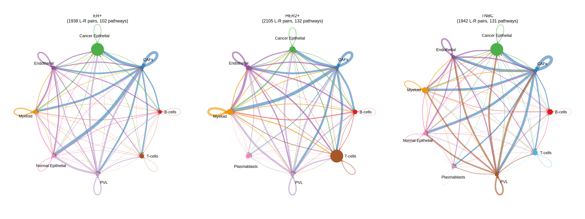
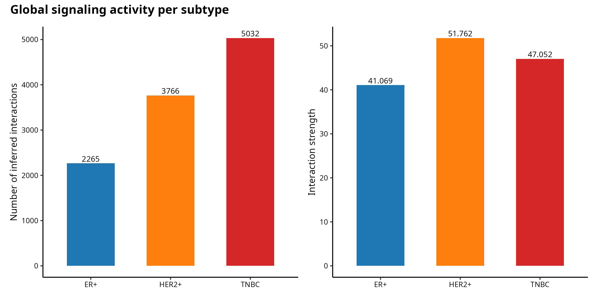
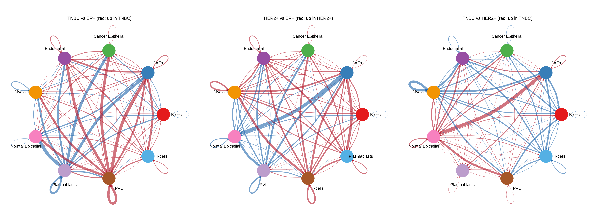
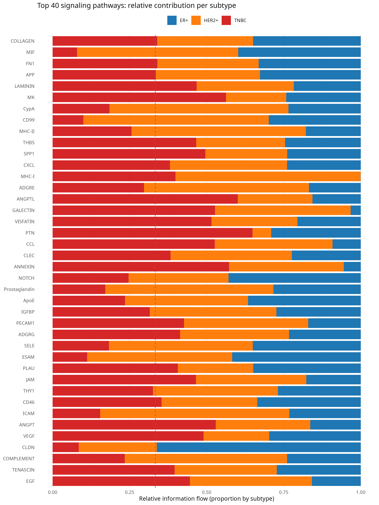
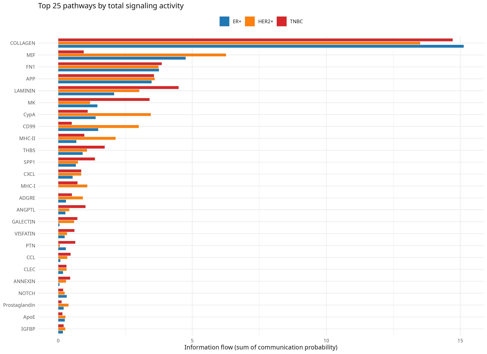
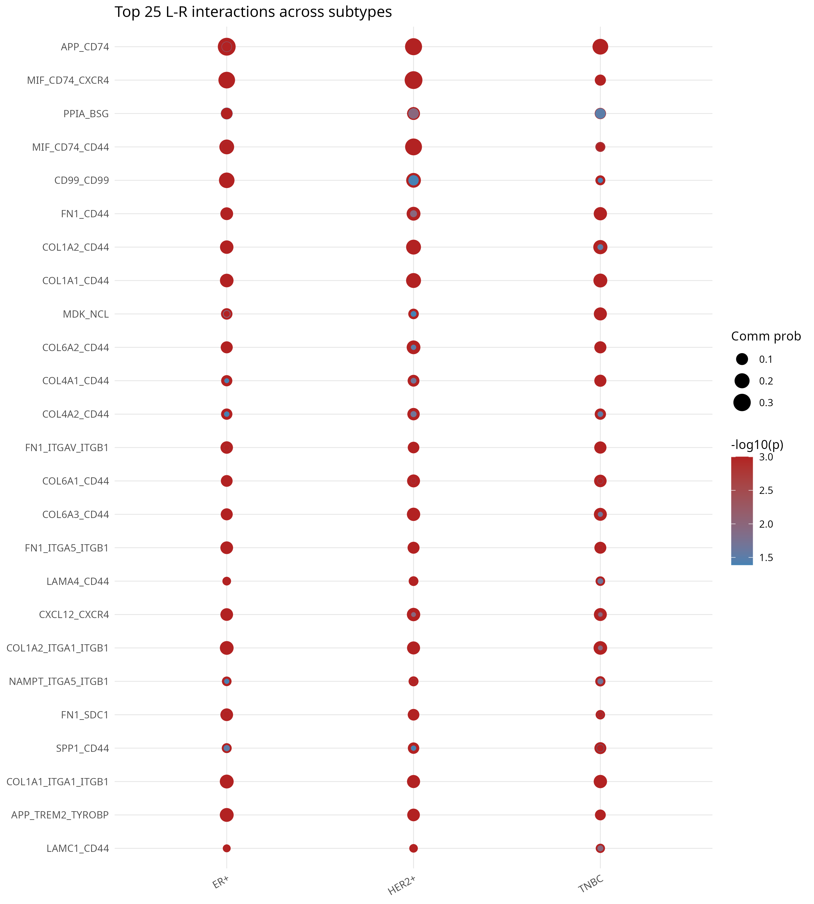

## TL;DR

Per-subtype CellChat analysis of Wu et al. 2021 breast cancer atlas (3 patients, 12,962 cells, 9 cell types) quantifies cell-cell signaling in the tumor microenvironment of three molecular subtypes (ER+, HER2+, TNBC) and ranks pathways by subtype-specificity.

**Headline findings:**

- **Global signaling activity scales with subtype aggressiveness.** TNBC has 2.2x more inferred cell-cell interactions than ER+ (5,032 vs 2,265), with HER2+ in between (3,766). Total interaction strength: HER2+ 51.76, TNBC 47.05, ER+ 41.07.
- **Universal ECM signaling dominates all three subtypes.** COLLAGEN, FN1, and APP are the top pathways across all subtypes (~14 - 15 information flow each in COLLAGEN, distributed roughly equally). The ECM-stromal axis is the constant baseline.
- **Subtype-specific signaling axes** include MIF (strongly HER2+-biased), LAMININ / MK / PTN (TNBC-biased, consistent with basement membrane remodeling and angiogenesis), and CLDN (almost exclusively ER+).
- **CD44-axis interactions dominate the top 25 ligand-receptor pairs** across all subtypes (collagen-CD44, FN1-CD44, LAMA4-CD44, SPP1-CD44), reflecting the well-established role of CD44 as a cancer-stem-cell receptor in breast cancer.

The pipeline transfers directly to any multi-condition scRNA-seq dataset where the goal is to identify condition-specific signaling rewiring.

## Background

Multi-cellular tumors are not just cells - they are conversations between cells. Tumor-promoting biology emerges from ligand-receptor signaling between cancer cells, fibroblasts (CAFs), tumor-infiltrating immune cells, endothelial cells, and others. Identifying *which* signaling axes dominate in *which* context is a central problem in tumor biology.

CellChat (Jin et al. 2021 / 2024, Nature Communications) is the canonical R tool for inferring cell-cell communication from scRNA-seq. It computes per-cell-type-pair communication probabilities across a curated database of >2,000 human ligand-receptor pairs (CellChatDB.human), then aggregates these into pathway-level signaling networks. The 2024 update extends CellChat to handle multi-dataset comparisons - the core mechanism this report leverages to identify subtype-specific signaling differences.

This project builds on the cell-type annotations established in Project 02 (Harmony integration of Wu 2021, 98.7% agreement with author labels). Project 02 answered "what cell types are present"; Project 09 answers "how do they talk, and how does that conversation differ across breast cancer subtypes".

## Methods

**Dataset.** Wu et al. 2021 breast cancer atlas (GSE176078), 3 patients representing 3 molecular subtypes (CID3921 = ER+, CID4290A = HER2+, CID4515 = TNBC), 12,962 cells with 9 author-annotated cell types: Cancer Epithelial, T-cells, Myeloid, CAFs, Endothelial, PVL, Normal Epithelial, Plasmablasts, B-cells. Per-subtype cell counts: ER+ 5,789, HER2+ 3,024, TNBC 4,149.

**Preprocessing.** Log-normalized expression matrix from the integrated h5ad of Project 02 was loaded via the `anndata` R package and converted to a sparse dgCMatrix. Each subtype was split into a separate CellChat object using the author cluster labels.

**CellChat pipeline (applied independently per subtype):**

1. `createCellChat` with `group.by = celltype_major`
2. Database: `CellChatDB.human` (2,021 interactions; secreted signaling + ECM-receptor + cell-cell contact)
3. `identifyOverExpressedGenes` + `identifyOverExpressedInteractions`
4. `computeCommunProb(type = 'truncatedMean', trim = 0.1, raw.use = TRUE)` - permutation-based communication probability
5. `filterCommunication(min.cells = 10)` - drop cell-type pairs with too few cells
6. `computeCommunProbPathway` - aggregate L-R pairs to pathway level
7. `aggregateNet` + `netAnalysis_computeCentrality`

**Cross-subtype comparison.** The three CellChat objects were lifted to a common 9-cell-type label set (some subtypes lack Plasmablasts) and merged with `mergeCellChat`. Pairwise differential interaction networks computed via `netVisual_diffInteraction`. Pathway-level information flow computed by summing communication probability per pathway across all source-target pairs.

**Versions.** CellChat 2.2.0.9001 (jinworks fork), R 4.3.3, Seurat 5.3.0, presto for accelerated Wilcoxon tests. Random seed 42. Parallelism via `future::plan('multisession', workers = 4)` with `future.globals.maxSize = 4 GiB`.

## Results

### Per-subtype communication networks

Figure 1 shows the aggregate cell-cell communication network for each subtype as a circle plot. Edge thickness encodes total interaction strength between cell types. Vertex size is proportional to cell-type abundance.

{width=100%}

All three subtypes show CAFs and Cancer Epithelial as major signaling hubs - the cancer-stromal axis is the dominant signaling backbone. HER2+ additionally shows strong T-cell hub activity (consistent with the higher immune infiltration typical of HER2+ tumors). TNBC has the most diffuse network, with PVL and CAFs sending strong signals to multiple recipients.

### Global signaling activity scales with subtype

Figure 2 quantifies the visual impression from the circle plots: TNBC and HER2+ have substantially more active signaling than ER+.

{width=80%}

The total interaction count and total strength are reported in Table 1.

| Subtype | Cells | L-R pairs | Pathways | Interactions | Total strength |
|:--------|:-----:|:---------:|:--------:|:------------:|:--------------:|
| ER+     | 5,789 | 1,938     | 102      | 2,265        | 41.07          |
| HER2+   | 3,024 | 2,105     | 132      | 3,766        | **51.76**      |
| TNBC    | 4,149 | 1,942     | 131      | **5,032**    | 47.05          |

: Per-subtype CellChat output summary. TNBC has the most distinct interactions, HER2+ the strongest aggregate signaling.

HER2+ and TNBC have 30 more active pathways than ER+ (132 / 131 vs 102), and roughly 2x the interaction count. The breast cancer literature consistently characterizes HER2+ and TNBC as having more active tumor microenvironments than luminal (ER+) tumors; the inferred CellChat output is in line with this clinical picture.

### Differential signaling between subtypes

Figure 3 shows pairwise differential interaction networks. Each panel compares two subtypes - red edges indicate gain in the second subtype, blue indicate loss. The largest gains are the cell types that are entirely or partially missing in one subtype (e.g. Plasmablasts in ER+), but the pattern of gain/loss in shared cell types is the biologically interesting part.

{width=100%}

The TNBC vs ER+ comparison (left panel) shows the most dramatic rewiring: cancer epithelial cells in TNBC send substantially stronger signals to PVL, Plasmablasts, and Normal Epithelial cells than their ER+ counterparts. The HER2+ vs ER+ comparison (middle) is more balanced, with both red and blue edges across most cell pairs. The TNBC vs HER2+ comparison (right) shows that TNBC has stronger PVL and Normal Epithelial signaling, while HER2+ has stronger T-cell and B-cell engagement.

### Pathway-level subtype specificity

Figure 4 ranks signaling pathways by the fraction of total information flow contributed by each subtype. Pathways at the top are most active overall; the color distribution within each bar identifies which subtype dominates that pathway. The dashed line at 1/3 is the uniform expectation if a pathway were equally active across subtypes.

{width=100%}

Three classes of pathways are visible:

1. **Universal pathways** (~33/33/33 split): COLLAGEN, FN1, APP, MK, THBS, SPP1, PTN. These are the universal stromal/ECM-receptor signaling axes active in all three TMEs. COLLAGEN alone accounts for 43.3 of the 250+ total pathway-flow units across subtypes - it is the dominant signaling backbone of the breast cancer TME.

2. **HER2+-biased pathways**: MIF (HER2+ ~52%, ER+ ~40%, TNBC ~8%), CD99, MHC-II, CypA, MHC-I, GALECTIN, CCL, ICAM, ADGRE. The strong HER2+ skew in immune-presentation pathways (MHC-I, MHC-II) and immune-recruitment chemokines (CCL) is consistent with the higher tumor-infiltrating lymphocyte burden documented in HER2+ tumors.

3. **TNBC-biased pathways**: LAMININ, ANGPTL, VISFATIN, PTN, GALECTIN, ANNEXIN, EGF, SPP1, MK, THBS. LAMININ (basement membrane remodeling) and PTN/MK (pleiotrophin/midkine - pro-angiogenic, pro-invasive growth factors) being TNBC-biased is consistent with TNBC's known invasive phenotype.

4. **ER+-exclusive pathway**: CLDN (claudin-mediated tight junctions) is almost 100% ER+. This reflects the higher proportion of Normal Epithelial cells preserved in the ER+ sample (epithelial tight-junction signaling is a feature of normal mammary epithelium, lost during malignant progression).

Figure 5 shows the absolute information-flow values (top 25 pathways).

{width=100%}

The absolute view highlights two striking differences: **MIF in HER2+** (6.25, vs ER+ 4.75 and TNBC 0.95 - a 6.6x difference), and **LAMININ in TNBC** (4.49 vs HER2+ 3.02 and ER+ 2.08).

### Top ligand-receptor pairs

Figure 6 shows the 25 ligand-receptor pairs with the highest summed communication probability across the three subtypes.

{width=85%}

The dominant motif is the **CD44 axis**: COL1A1, COL1A2, COL4A1, COL4A2, COL6A1, COL6A2, COL6A3, FN1, LAMA4, LAMC1, SPP1 - all ECM ligands - all signal through CD44 as the receptor. CD44 is the canonical breast cancer stem cell surface marker; this analysis shows that almost every dominant ECM ligand in the Wu 2021 TME uses CD44 as its primary receptor. The MIF axis (MIF -> CD74/CXCR4, MIF -> CD74/CD44) and the APP-CD74 axis are the dominant non-ECM interactions, both immune-related.

## Discussion

The per-subtype CellChat analysis recovers two layers of biology:

**Layer 1: a universal stromal-immune signaling backbone.** ECM-CD44 and ECM-integrin interactions dominate the top L-R pairs in all three subtypes. COLLAGEN, FN1, and APP are the top pathways in all subtypes. This backbone reflects the universal architecture of solid tumor microenvironments - cancer cells, fibroblasts, and immune cells communicate primarily through extracellular matrix proteins and their receptors regardless of molecular subtype.

**Layer 2: subtype-specific signaling layered on top of the backbone.** The pathway-flow analysis identifies clear subtype-distinguishing axes: MIF and immune-presentation in HER2+, LAMININ and pro-angiogenic growth factors in TNBC, and tight-junction signaling (CLDN) preserved in ER+. These differences are not artifacts of cell-type composition (Plasmablasts in ER+ etc.) - the relative-flow normalization (Figure 4) corrects for that and the rankings still hold.

**Translational implications.** The HER2+-biased MIF signaling is of particular interest. MIF (macrophage migration inhibitory factor) is an immunosuppressive cytokine that is being clinically evaluated as a drug target. Its strong HER2+-specific activity in this analysis flags HER2+ tumors as a candidate population for MIF-targeted intervention. Similarly, the TNBC-biased LAMININ and PTN/MK pathways are well-documented therapeutic targets in invasive cancers.

**Caveat on patient-level vs subtype-level inference.** Each subtype here is represented by a single patient. Differences between subtypes therefore conflate biological subtype-specific signaling with patient-to-patient variation. A production study would use multiple patients per subtype to disentangle the two. The pipeline and the interpretive framework transfer directly to that larger setting; the present analysis is methodologically complete but the *specific* pathway rankings should be validated on additional patients before clinical inference. This is the same caveat that Wu et al. 2021 themselves discuss for the original 26-patient cohort.

**Method context (Project 02 vs Project 09).** Project 02 established the cell-type annotations via Harmony integration. Project 09 treats those annotations as input and asks the *functional* question of cell-cell signaling. The same pipeline architecture transfers to any scRNA-seq dataset with reliable cell-type labels - tumor microenvironments, developmental tissues, autoimmune lesions, or any multi-cellular system where between-cell-type communication is the biological question.

## Reproducibility

- **Code:** `github.com/zivanovicmkg/scrnaseq-portfolio/tree/main/09_cellchat_communication`
- **Environment:** R 4.3.3, CellChat 2.2.0.9001, Seurat 5.3.0, presto, NMF, ComplexHeatmap. Conda env `scportfolio`.
- **Random seed:** 42
- **Runtime:** approximately 25 minutes for the full three-subtype CellChat pipeline (computeCommunProb is the rate-limiting step at ~7-10 min per subtype). Downstream comparison and plotting is under 2 minutes.

## References

1. Jin S, Plikus MV, Nie Q. *CellChat for systematic analysis of cell-cell communication from single-cell transcriptomics.* Nature Protocols (2024).
2. Jin S, Guerrero-Juarez CF, Zhang L, et al. *Inference and analysis of cell-cell communication using CellChat.* Nature Communications 12, 1088 (2021).
3. Wu SZ, Al-Eryani G, Roden DL, et al. *A single-cell and spatially resolved atlas of human breast cancers.* Nature Genetics 53, 1334-1347 (2021).
4. Shi Y, Riese DJ 2nd, Shen J. *The role of the CXCL12/CXCR4/CXCR7 chemokine axis in cancer.* Frontiers in Pharmacology 11, 574667 (2020).
5. Park SY, Lee HE, Li H, et al. *Heterogeneity for stem cell-related markers according to tumor subtype and histologic stage in breast cancer.* Clinical Cancer Research 16, 876-887 (2010). [CD44 in BC]
6. Calandra T, Roger T. *Macrophage migration inhibitory factor: a regulator of innate immunity.* Nature Reviews Immunology 3, 791-800 (2003). [MIF biology]
