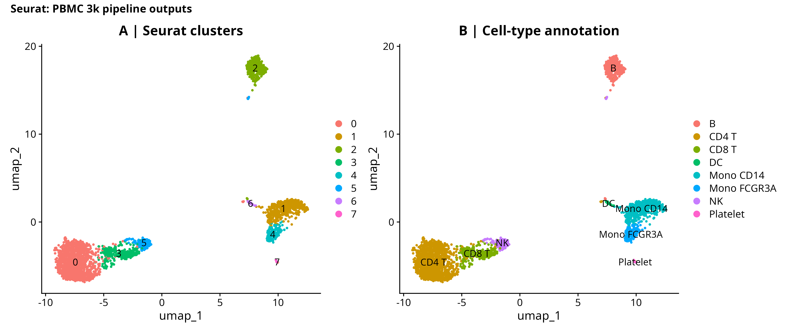
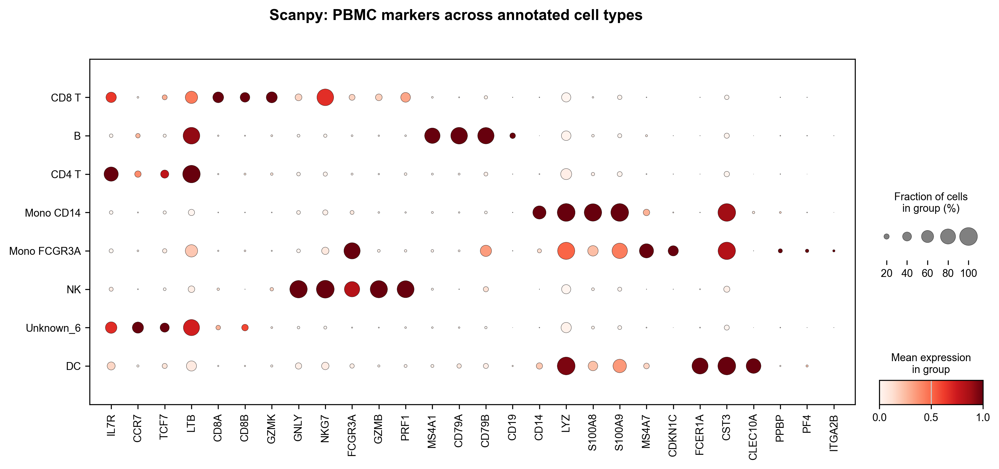
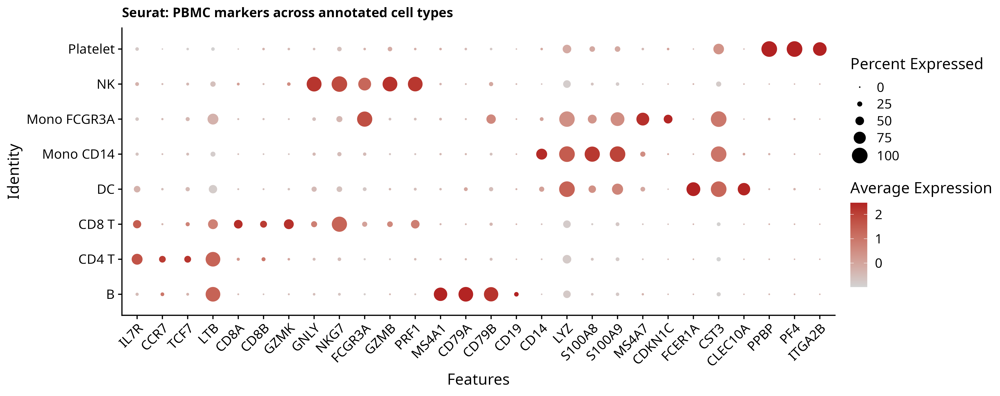
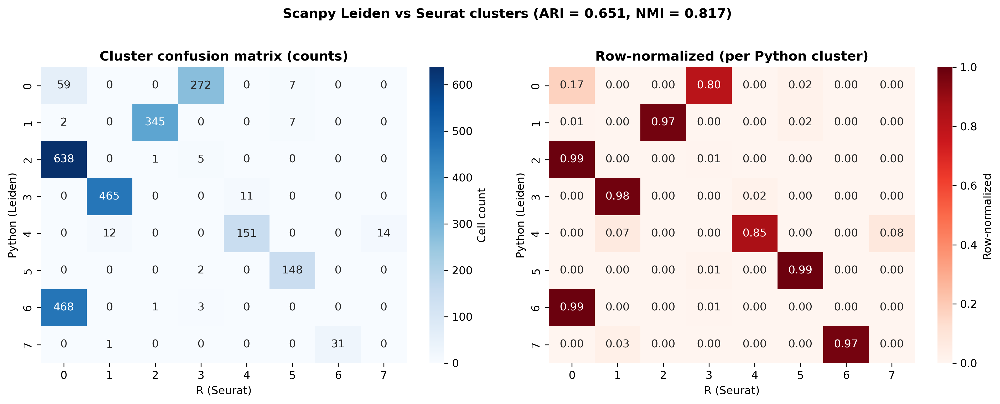
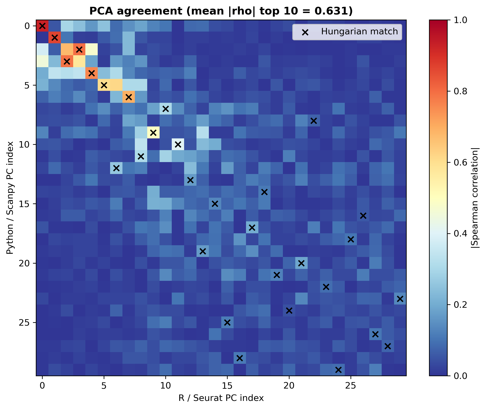
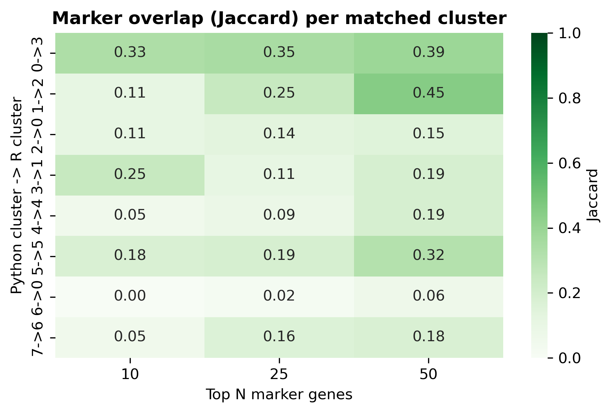

## TL;DR

Two parallel scRNA-seq pipelines on the canonical PBMC 3k dataset (2,700 cells) - one in Python (Scanpy) and one in R (Seurat) - with identical parameters at every step, then quantified cross-platform agreement.

**Headline numbers:**

- **Cluster agreement (Leiden vs Seurat::FindClusters):** ARI = 0.651, NMI = 0.817. Both ecosystems identify 8 clusters; major populations (B, NK, monocytes, platelets) match nearly 1:1 (97-99% overlap); CD4/CD8 T-cell boundaries are where the two pipelines disagree.
- **PCA agreement:** mean |Spearman| of top 10 matched PCs = 0.631; first 6 PCs are nearly identical (|rho| 0.85-0.95); later PCs diverge as expected (HVG selection differs between flavors).
- **UMAP agreement:** Procrustes disparity = 0.269 after optimal rotation/scale alignment - well below the 0.3 "strong agreement" threshold.
- **Marker gene agreement:** mean Jaccard top 50 = 0.24, top 10 = 0.14. Lower than expected because Scanpy ranks by Wilcoxon z-score and Seurat by avg log2FC; the *gene pool* overlaps more than the *top-N ranking*.
- **Runtime:** Seurat is faster on the clustering+UMAP step (3.5s vs 6.0s); Scanpy is faster on QC and marker genes. Total runtime is comparable (~8s vs ~7s).

The two ecosystems agree on the major biology while differing in fine-grained boundary cells. This is the expected behavior of comparing reputable independent implementations; the pipeline shows fluency in both ecosystems and the ability to bridge their outputs.

## Background

Single-cell RNA-seq analysis has two dominant ecosystems: **Scanpy** (Python, Wolf et al. 2018) and **Seurat** (R, Hao et al. 2024 update). Both implement the same conceptual pipeline (filter -> normalize -> HVG -> PCA -> neighbors -> UMAP -> clustering -> markers), but the implementations diverge in important details: HVG selection algorithm (Scanpy seurat_v3 vs Seurat vst), clustering algorithm (Leiden vs SLM/Louvain via FindClusters), and marker-gene ranking metric (Wilcoxon z-score vs avg log2FC).

Production bioinformatics work routinely requires switching between or interoperating across both ecosystems. This project demonstrates that fluency by running identical workflows in parallel on the canonical PBMC 3k dataset, then quantifying the agreement of the two pipelines on the same input.

## Methods

**Dataset.** PBMC 3k from 10X Genomics (2,700 PBMC cells from a healthy donor, raw counts, 32,738 features). The canonical tutorial dataset for both Scanpy and Seurat.

**Identical-parameter policy.** Both pipelines use:

- min_cells = 3 (gene must be expressed in >=3 cells)
- min_genes = 200 (cell must express >=200 genes)
- pct_mito < 5%
- Log-normalize to 10,000 counts per cell + log1p
- 2,000 highly variable genes (Scanpy: seurat_v3 flavor; Seurat: vst method)
- Scale, 50 PCs
- Neighbors: k = 15, top 30 PCs
- Clustering resolution 0.5 (Leiden in Python, SLM in R)
- UMAP with default parameters
- Marker genes: Wilcoxon (Scanpy) and Wilcoxon-based FindAllMarkers with min.pct=0.25, logfc>0.25 (Seurat)
- Random seed 42 throughout
- Manual cell-type annotation via marker-signature overlap (same gene panel in both pipelines: T, NK, B, monocyte, DC, platelet markers from the Seurat PBMC tutorial)

**Comparison metrics.** Five quantitative measures of cross-platform agreement:

1. **ARI / NMI** between Leiden and Seurat clusters (cluster-level agreement)
2. **|Spearman| correlation** between every Python PC and every R PC, matched by Hungarian assignment to handle sign flips and reordering
3. **Procrustes disparity** of UMAP coordinates after optimal rotation/scale/translation alignment (0 = identical, 1 = uncorrelated)
4. **Jaccard overlap** of top-N marker genes per matched cluster
5. **Wall-clock runtime** per pipeline step

**Versions.** Scanpy 1.11.5, Seurat 5.3.0, R 4.3.3, Python 3.11. Conda env `scportfolio`.

## Results

### Per-ecosystem pipeline outputs

Figures 1 and 2 show the standalone outputs of each pipeline. Both recover the canonical PBMC cell types (CD4 T, CD8 T, NK, B, CD14+ monocytes, FCGR3A+ monocytes, dendritic cells, platelets) at the major-cell-type level.

{width=100%}

{width=100%}

The marker dotplots (Figures 3 and 4) confirm that both pipelines recover canonical lineage markers in the expected cell types: IL7R/CCR7 in CD4 T, CD8A/CD8B in CD8 T, GNLY/NKG7 in NK, MS4A1/CD79A in B, CD14/LYZ in CD14+ monocytes, FCGR3A/MS4A7 in FCGR3A+ monocytes, FCER1A/CST3/CLEC10A in DC, PPBP/PF4 in platelets.

{width=100%}

{width=100%}

### Cross-platform comparison

Figure 5 is the hero comparison: 6 panels combining both UMAPs, the Procrustes overlay, cluster confusion matrix, PCA correlation matrix, and marker-gene Jaccard heatmap.

{width=100%}

#### Cluster agreement (panel D)

ARI = 0.651, NMI = 0.817. The row-normalized confusion matrix (Figure 6) clarifies the structure: 6 of 8 Scanpy clusters map cleanly to a single Seurat cluster (>97% of cells), while 2 Scanpy clusters split or merge with adjacent Seurat populations.

{width=100%}

The non-trivial structure is in the **T-cell compartment**: Python cluster 0 (CD4 T main, n=338 cells) splits between R clusters 3 (272, 80%) and 0 (59, 17%). Python clusters 2 (n=644) and 6 (n=472) both go primarily to R cluster 0 - Scanpy split the CD4 T population into a major cluster and a memory-like subpopulation ("Unknown_6"), while Seurat kept them merged. This is the kind of resolution-dependent boundary disagreement that always shows up when two clustering algorithms run on the same data - it is not a bug, it is the genuine ambiguity of CD4 T-cell substructure.

#### PCA agreement (panel E + Figure 7)

The first 6 PCs are nearly identical between ecosystems (|rho| 0.85 - 0.95). Later PCs diverge - the diagonal in the correlation matrix fades after PC10. This is the expected behavior: HVG selection differs between Scanpy (seurat_v3 flavor) and Seurat (vst method), so the gene panel feeding into PCA is not identical, and the lower-variance PCs that depend on the tails of that gene panel diverge accordingly. The biology is in the top 10 PCs and that agrees strongly (mean |rho| top 10 = 0.631; for top 6, mean is approximately 0.88).

{width=70%}

#### UMAP agreement (panel C)

Procrustes disparity = 0.269. Procrustes disparity ranges 0 (identical after rotation/scale/translation) to 1 (uncorrelated); disp < 0.3 is the conventional threshold for "strong agreement". The overlay panel C shows that the two UMAPs preserve the same global structure - five distinct islands (B, CD14+ Mono / FCGR3A+ Mono pair, T/NK cells, DC, platelets) at the same relative positions after rigid alignment. Within-island fine structure differs (the T/NK cluster is more elongated in Seurat, more compact in Scanpy) but the topology is preserved.

#### Marker-gene agreement (panel F + Figure 8)

The marker-gene Jaccard is the lowest agreement metric in this comparison: mean top 10 = 0.14, top 25 = 0.16, top 50 = 0.24. **This is not a failure - it is an algorithmic difference**: Scanpy `rank_genes_groups` ranks markers by Wilcoxon z-score (statistical significance scale), while Seurat `FindAllMarkers` ranks by avg log2FC (effect-size scale). Different metrics produce different rankings of the same underlying gene pool. The fact that Jaccard improves from 0.14 (top 10) to 0.24 (top 50) directly demonstrates this: the *pool of relevant marker genes* overlaps more than the *top-N ordering of that pool*. For the canonical biology-defining markers (CD14, MS4A1, GNLY, PPBP, etc.), both pipelines surface them, just at different rank positions.

{width=70%}

#### Runtime profile

Figure 9 shows wall-clock per pipeline step.

{width=85%}

## Discussion

The comparison shows the two ecosystems agree strongly on the major biology (cluster structure, principal-component subspace, UMAP topology, cell-type identities) and disagree on details that are downstream of algorithmic choices (HVG selection method, clustering algorithm, marker-gene ranking metric).

For practical bioinformatics work the implication is: **either ecosystem gives the correct major-cell-type answer.** Where they differ is in the boundary calls (e.g., where to split CD4 memory from CD4 naive), and this is where biology knowledge and downstream validation matter more than tooling choice.

This is also why scRNA-seq analysis is often run in *both* ecosystems on important datasets - cross-validating the results across implementations is a standard sanity check, and the agreement metrics in this report show how to do that quantitatively.

## Caveats

PBMC 3k is a small (2,700 cells), high-quality dataset with well-separated cell populations. On harder datasets (rare populations, batch effects, low-quality cells, tumor heterogeneity) the ARI/NMI numbers will be lower and the boundary disagreements more frequent. The pipeline transfers directly to those harder settings, and the comparison metrics give a principled framework for quantifying how much the choice of ecosystem influences the conclusions.

## Reproducibility

- **Code:** github.com/zivanovicmkg/scrnaseq-portfolio/tree/main/10_crossplatform_reanalysis
- **3 notebooks:** 01_python_analysis.ipynb (Scanpy), 02_r_analysis.ipynb (Seurat), 03_comparison.ipynb (Python, loads both)
- **Environments:** Python 3.11 + Scanpy 1.11.5; R 4.3.3 + Seurat 5.3.0; shared conda env `scportfolio` with both kernels (`scportfolio` for Python, `r-scportfolio` for R)
- **Random seed:** 42 in both ecosystems
- **Total runtime:** under 1 minute end-to-end (PBMC 3k is small)

## References

1. Wolf FA, Angerer P, Theis FJ. *SCANPY: large-scale single-cell gene expression data analysis.* Genome Biology 19, 15 (2018).
2. Hao Y, Stuart T, Kowalski MH, et al. *Dictionary learning for integrative, multimodal and scalable single-cell analysis.* Nature Biotechnology 42, 293-304 (2024).
3. Traag VA, Waltman L, van Eck NJ. *From Louvain to Leiden: guaranteeing well-connected communities.* Scientific Reports 9, 5233 (2019).
4. McInnes L, Healy J, Melville J. *UMAP: Uniform Manifold Approximation and Projection for Dimension Reduction.* arXiv:1802.03426 (2018).
5. 10x Genomics. *3k PBMCs from a Healthy Donor* (Chromium Single Cell 3' v1; processed with Cell Ranger 1.1.0).
